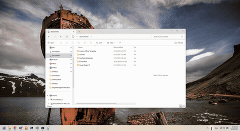

# RedLight

RedLight is a lightweight Windows utility that applies a customizable full-screen color filter. It is designed to help reduce eye strain or assist with accessibility.

## Download

You can download the latest (`RedLightForWindows.exe`) from the **[Releases](../../releases)** page.

## Features

*   **Full-Screen Filters:** Apply various color matrices to the entire screen using the Windows Magnification API.
*   **Filter Modes:**
    *   **Red:** Reduces blue light, ideal for night usage.
    *   **Grayscale:** Converts the screen to black and white.
    *   **Color Blindness Simulations:** Protanopia (Red/Green), Deuteranopia (Green/Red), and Tritanopia (Blue/Yellow).
*   **Adjustable Intensity:** Fine-tune the strength of the filter using a slider.
*   **Tray Popup:** Lives in the system tray; click the icon to toggle a popup with all controls.

## Requirements

*   Windows 10 or Windows 11

## Usage

1.  Run the application. It starts in the system tray.
2.  Click the tray icon to open the popup.
3.  Check **Enable Fullscreen Filter** to start.
4.  Select a **Filter Type** from the dropdown.
5.  Adjust the **Intensity** slider to control the effect strength.
6.  Click outside the popup to dismiss it. Click **Quit** to exit.

## Stack

*   **Framework:** .NET 10 (WPF & Windows Forms components)
*   **API:** Windows Magnification API (`MagSetFullscreenColorEffect`)
